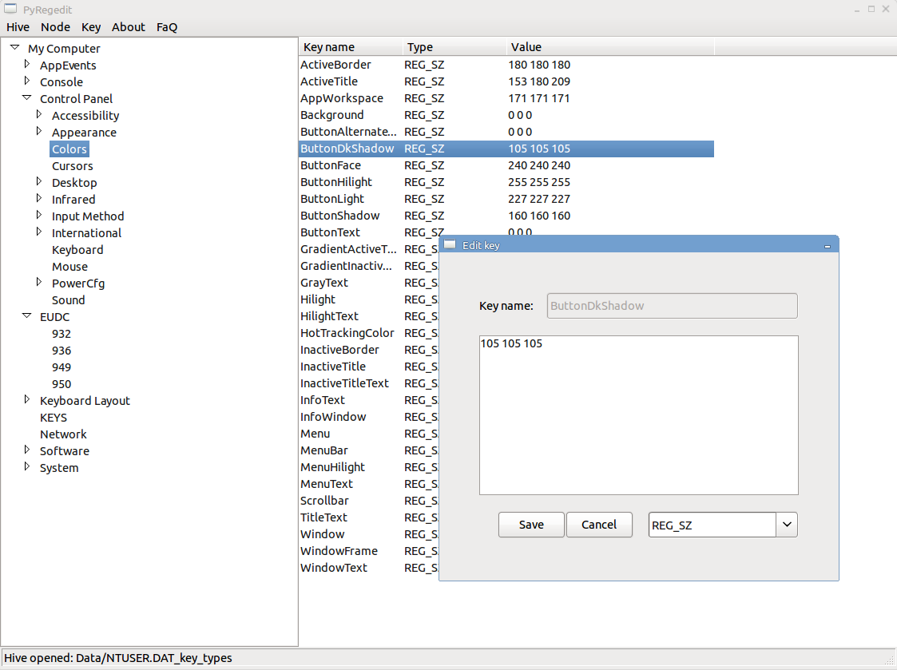

# PyRegedit

Project for GUI editor of Windows Registry hives.
This project aim to allow users to access their data from Linux platform,
without using any Microsoft proprietary API.

## Supported operations

* Show directory structure like tree view
* Show list of keys -> values foreach node
* Add new node to node tree
* Remove node from node tree
* Edit registry key value
* Add new registry key value
* Deleting single key

## FAQ

### Is changes directly saved to hive?

No. All changes which you made on current hive are not saved until you
manually saved it. Also, after first save is made a backup copy - which
should help, when something happend with original file.

### How is performed changes of hive?

About all low-end operations with hive is responsible library hivex,
this library is designed to change values directly in binary structure of
any hive.

### Is there any limitations?

Yes, this editor is only interface for cumunication with library hivex. If
hivex doesn't support any type of operation it's not possible to do that. For
more please see this - http://libguestfs.org/hivex.3.html

### Why I should use this and not hivex directly?

This editor should only make esier access to hive for users, which are not
so technical advanced to use hivex directly from command line or program their
own solution.

## Requirements

* hivex 1.3.7
* wxPython
* python 2.*

## Screenshot

## Resources & Links
* http://gitweb.samba.org/?p=samba.git;a=tree;f=source/lib/registry;h=21934b5f658009ff0383f6aed41b102013b5b046;hb=v4-0-stable.
* http://sentinelchicken.com/research/registry_format/
* http://www.beginningtoseethelight.org/ntsecurity/index.php+
* http://libguestfs.org/hivex.3.html
